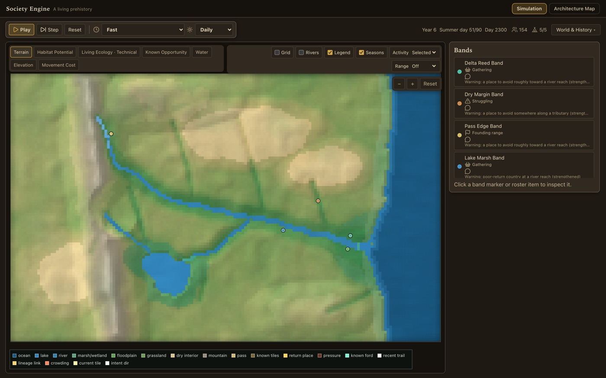
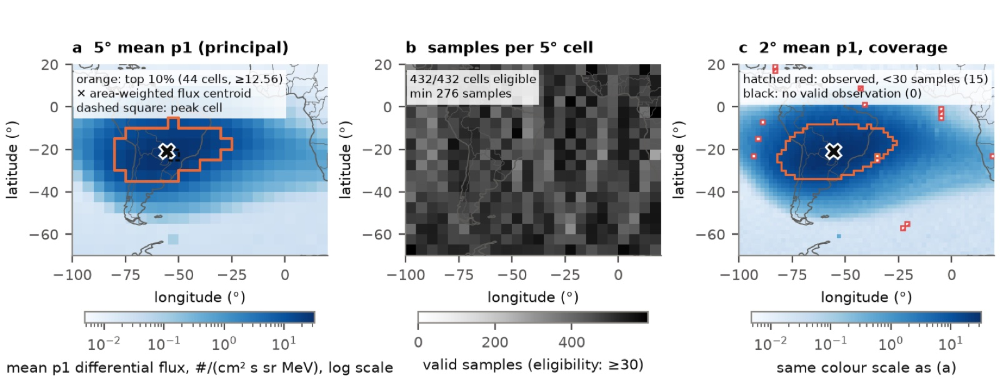
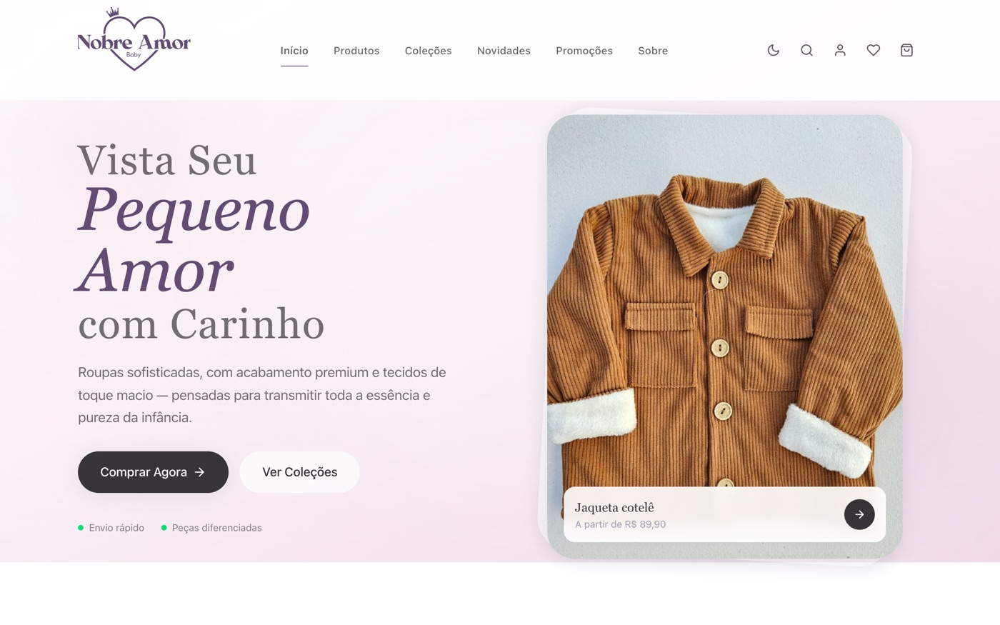
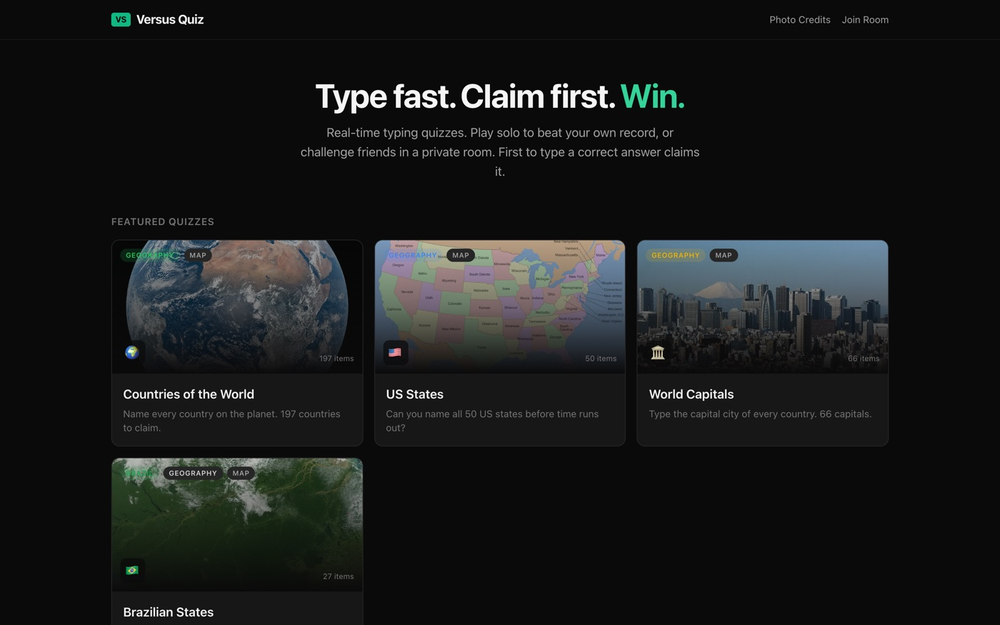
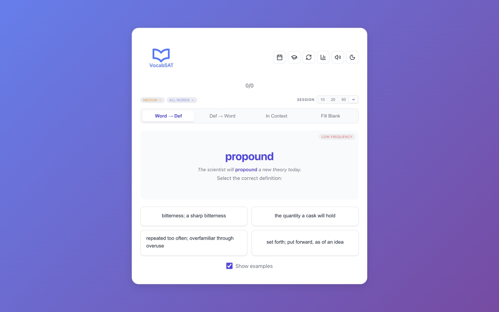

# Fellipe Gonçalves Leite

Student at **CEFET-MG** in Divinópolis, Brazil. I build software end to end: a society simulation, an independent space-weather study, and products that real people use.

I care most about work that can be checked: reproducible results, explicit assumptions, and systems you can open up and inspect.

**Live now:** [brasilafora.org](https://brasilafora.org) · [nobreamor.com](https://www.nobreamor.com) · [Society Engine demo](https://society-engine.vercel.app)

---

## Society Engine
**A deterministic simulation of early human societies** · TypeScript · React · Canvas

Small bands of people move through a seasonal world. They find food and water, remember good and dangerous places, send out foraging trips, grow, split into new groups and build up their own histories. Nothing is scripted: every behaviour comes from what a band can actually see, remember and carry. The same seed always replays the same history.

[▶ Try it in the browser](https://society-engine.vercel.app) · [Repository](https://github.com/fellipegoncalvesleite/society-engine)

## South Atlantic Anomaly mapping
**Independent research** · Python · NOAA satellite data

How much does a map of the South Atlantic Anomaly depend on the analyst's choices? Using public NOAA POES/MetOp proton data from January 2024, I tested how the threshold, proton channel, grid size, time window and satellite each change the footprint's position and size.

*Manuscript in preparation:* "Analysis choices and orbital sampling shape a particle-defined South Atlantic Anomaly footprint."

[Repository and reproducible workflow](https://github.com/fellipegoncalvesleite/saa-poes-mapping)

## Brasil Afora
**Main developer** · Next.js · TypeScript · PostgreSQL · [brasilafora.org](https://brasilafora.org)

A platform that helps Brazilian students find verified scholarships, summer programs, exchanges, olympiads and science fairs in Brazil and abroad. I built most of it: the catalog, opportunity pages, the map, student profiles and checklists, the admin tools and the search optimisation. The code lives in the project's organization.

[Website](https://brasilafora.org) · [Repository (Brasil-Afora org)](https://github.com/Brasil-Afora/brasil-afora)

## Cresce
**PIBIC Jr. research internship at UFSJ** · Flutter · Dart

A baby-care app for parents: daily routines, growth records, the vaccination schedule, age-appropriate activities, stories and sounds, and an AI assistant that answers questions about the baby's own records. I built the Flutter app.

[Repository](https://github.com/fellipegoncalvesleite/cresce)

## Nobre Amor
**Online store, live** · React · Supabase · [nobreamor.com](https://www.nobreamor.com)

A children's clothing store with a catalog, customer accounts, Pix and card checkout, shipping quotes and an admin panel.

[Website](https://www.nobreamor.com) · [Repository](https://github.com/fellipegoncalvesleite/nobre-amor-baby)

## Smaller projects

<table>
<tr>
<td width="50%" valign="top">
 
<b><a href="https://github.com/fellipegoncalvesleite/versus-quiz">Versus Quiz</a></b>: real-time multiplayer typing quiz. Friends share a room and race to claim answers. <a href="https://versus-quiz.vercel.app">Play</a>
</td>
<td width="50%" valign="top">
 
<b><a href="https://github.com/fellipegoncalvesleite/satvocab">VocabSAT</a></b>: SAT vocabulary game I made for my own prep, with 4,489 words and four quiz modes. <a href="https://satvocab-eta.vercel.app">Play</a>
</td>
</tr>
</table>

Also: [ChatGPT Development Bridge](https://github.com/fellipegoncalvesleite/chatgpt-github-mcp-app) (self-hosted MCP server) · [Minecraft plugins](https://github.com/fellipegoncalvesleite/minecraft-plugins) (Java) · [Python projects](https://github.com/fellipegoncalvesleite/python-projects) · [School projects](https://github.com/fellipegoncalvesleite/school-projects)

---

**Tools:** Python · TypeScript · React / Next.js · PostgreSQL · Supabase · Flutter / Dart · Git

[LinkedIn](https://www.linkedin.com/in/fellipe-leite-05a41242a/)
