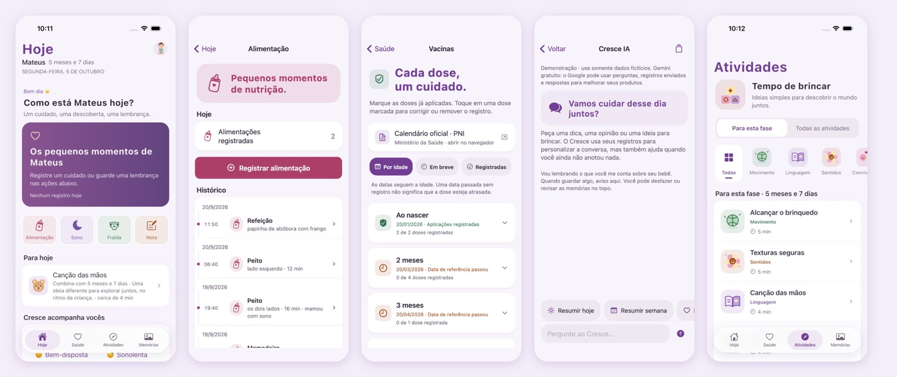

# Fellipe Gonçalves Leite

Student at **CEFET-MG** in Divinópolis, Brazil. I build software end to end: products that real people use, a large simulation, and an independent space-weather study.

I care most about work that can be checked: reproducible results, explicit assumptions, and systems you can open up and inspect.

**Live now:** [brasilafora.org](https://brasilafora.org) · [nobreamor.com](https://www.nobreamor.com)

---

## Brasil Afora
**Main developer** · Next.js · TypeScript · PostgreSQL · [brasilafora.org](https://brasilafora.org)

A platform that helps Brazilian students find verified scholarships, summer programs, exchanges, olympiads and science fairs in Brazil and abroad. I built most of it: the catalog, opportunity pages, the map, student profiles and checklists, the admin tools and the search optimisation. The code lives in the project's organization.

[Website](https://brasilafora.org) · [Repository (Brasil-Afora org)](https://github.com/Brasil-Afora/brasil-afora)

## Society Engine
**A deterministic simulation of early human societies** · ~140,000 lines of TypeScript

Bands of people move through a seasonal world, find food, remember places, send out expeditions, grow and split into new groups. Nothing is scripted, and the hard rule is **no omniscience**: a band can only act on what it could actually have seen, remembered or been told.

- Pure simulation core (165 modules) with no UI dependency; runs in a Web Worker or headless in Node.
- Fully deterministic: the same seed always replays the same history.
- Checked by measurement: 224 audit scripts and counterfactual runs that prove each mechanism actually changes outcomes.
- Invariants made structural where possible, so a wrong value is unreachable instead of caught later.

[Repository and architecture](https://github.com/fellipegoncalvesleite/society-engine) · [Demo](https://society-engine.vercel.app)

## Cresce
**PIBIC Jr. research internship at UFSJ** · Flutter · Supabase

A baby-care diary for Brazilian families: feeds, sleep, diapers, growth, the vaccine checklist, activities for the baby's phase, and memories. It works offline and syncs to private accounts, and Cresce IA answers questions about the baby's own records without being able to change them. I built the Flutter app, the account and sync layer and the assistant service.

[Repository](https://github.com/fellipegoncalvesleite/cresce)

## South Atlantic Anomaly mapping
**Independent research** · Python · NOAA satellite data

How much does a map of the South Atlantic Anomaly depend on the analyst's choices? Using public NOAA POES/MetOp proton data from January 2024, I tested how the threshold, proton channel, grid size, time window and satellite each change the footprint's position and size.

*Manuscript in preparation:* "Analysis choices and orbital sampling shape a particle-defined South Atlantic Anomaly footprint."

[Repository and reproducible workflow](https://github.com/fellipegoncalvesleite/saa-poes-mapping)

## Nobre Amor
**Online store, live** · React · Supabase · [nobreamor.com](https://www.nobreamor.com)

A children's clothing store with a catalog, customer accounts, Pix and card checkout, shipping quotes and an admin panel.

[Website](https://www.nobreamor.com) · [Repository](https://github.com/fellipegoncalvesleite/nobre-amor-baby)

## VocabSAT
**SAT vocabulary game** · React · [Play](https://satvocab-eta.vercel.app)

I made it for my own SAT prep: 4,489 words, four quiz modes, a daily challenge and progress tracking.

[Repository](https://github.com/fellipegoncalvesleite/satvocab)

## Smaller projects

[Versus Quiz](https://github.com/fellipegoncalvesleite/versus-quiz) (real-time multiplayer quiz, [play](https://versus-quiz.vercel.app)) · [ChatGPT Development Bridge](https://github.com/fellipegoncalvesleite/chatgpt-github-mcp-app) (self-hosted MCP server) · [Minecraft plugins](https://github.com/fellipegoncalvesleite/minecraft-plugins) (Java) · [Python projects](https://github.com/fellipegoncalvesleite/python-projects) · [School projects](https://github.com/fellipegoncalvesleite/school-projects)

---

**Tools:** Python · TypeScript · React / Next.js · PostgreSQL · Supabase · Flutter / Dart · Git

[LinkedIn](https://www.linkedin.com/in/fellipe-leite-05a41242a/)
